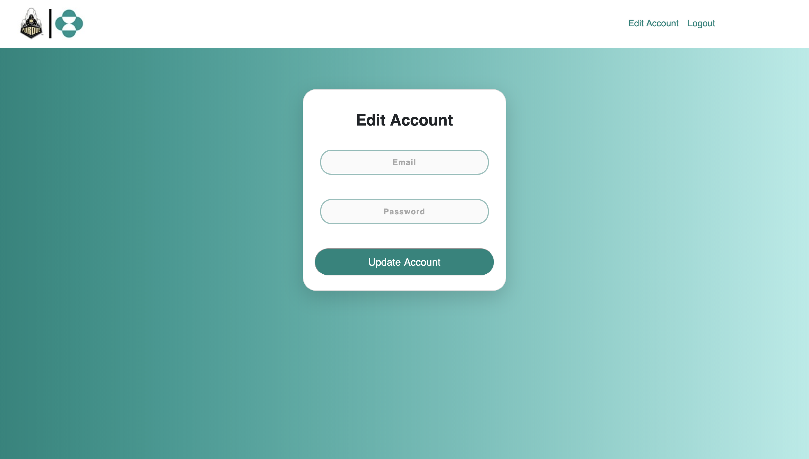
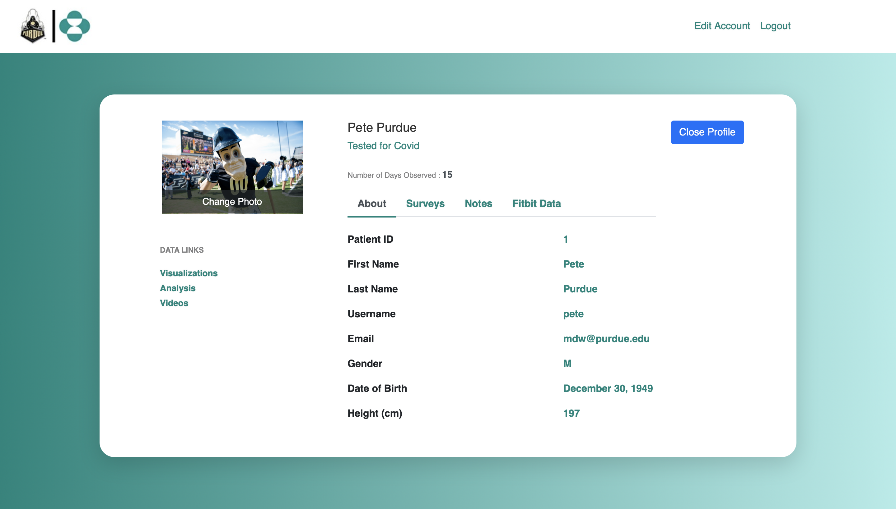
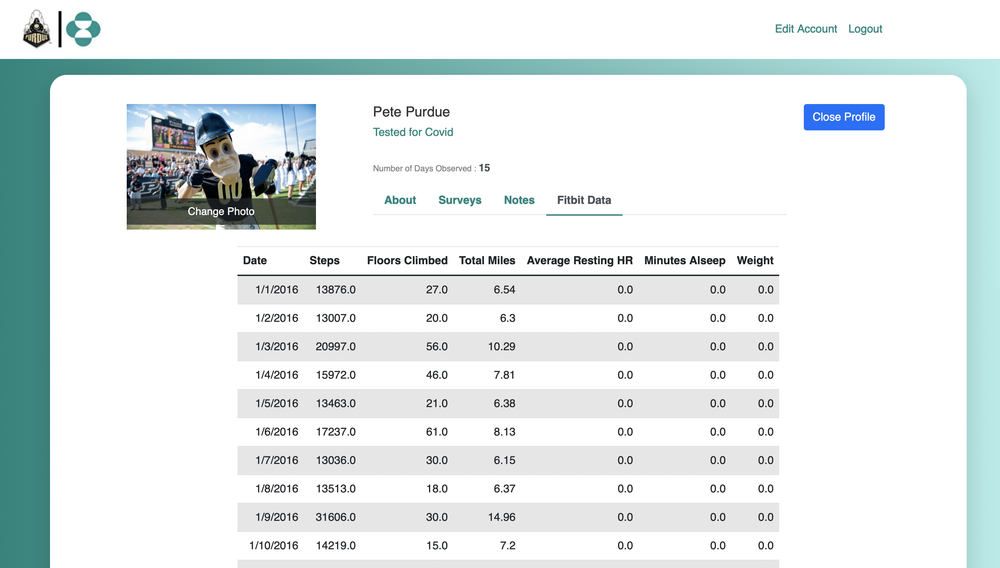
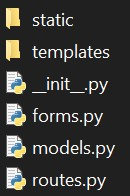

# Merck Web Application

## Setting up the Database

In `__init__.py`, change lines 10-11 by adding the information to your mySQL database:

```{python}
conn = "mysql+pymysql://{0}:{1}@{2}:{3}/{4}".format(
    'USERNAME', 'PASSWORD', 'NAME OF DATABASE', 'PORT NUMBER', 'TABLE NAME')
```

In line 15, add your SECRET KEY:

```{python}
app.config['SECRET_KEY'] = 'SECRET KEY'
```

## Running the app

```{python}
python run.py
```

## Installing Dependencies

`pip` needs to be installed in your system to install the dependencies required for this webapp.

If you do not have `pip` installed, follow this tutorial:  
https://pip.pypa.io/en/stable/installing/

If a certain module isn't installed in your system, use the following command to install it:

```{bash}
pip install -U <name of module>
```

# Website design

## Choosing a Framework
There are a seemingly endless number of options of web frameworks one could use to build a website from scratch. To narrow down the search of what framework to use, our team selected to use one designed for Python. Python is one of the easier languages to learn and implement. It is readable and is very well documented. On top of that, Python is the language we are most comfortable with, which allowed us to focus on building the project rather than learning a new programming language. There are several packages designed for web frameworks in Python. Django and Flask are by far the most popular and widely-used packages. They are both free to use and open-source with plenty of additional packages built by the community to ease the development process. After some deliberation and experimentation, Flask was chosen because it is simpler and easier to make small applications than Django.

Flask applications typically follow the same structure- an initialization file (__init__.py), a routes file (routes.py), a forms file (forms.py), and a models file (models.py).

## Scripts Explained

### Initialization

This file will set up the Flask application, along with every other application the website will utilize. For our website, this means Flask, SQLAlchemy, Flask bcrypt, and Flask Login will all need to be instantiated as part of the Flask application.

SQLAlchemy is how our application interfaces with our SQL database.
Flask Bcrypt is a Flask extension that provides bcrypt hashing utilities. Bcrypt is a password-hashing function, which we use to hash user passwords before storing them in the database.
Flask Login is a Flask extension that provides user session management. It handles logging in, logging out, and user sessions.
Forms

### Forms

Forms in Flask are handled by FlaskForm, which is from the Flask-WTF package. It offers an easy way to collect input data from a user because it interfaces with HTML scripts seamlessly. To create a form, simply define a class with the name of the form that inherits from FlaskForm. Then define each input with a variable name. Each of these variables will have a type of field that Flask-WTF defines. The most used ones include StringField, DateField, TextAreaField, and SubmitField. Each of these instances of an input field have the option for validators, meaning when the form is submitted, the data will be tested based on the validator to determine if the input field contains valid information. For example, if a form contains an input for email, a Flask-WTF provided validator that should be used is Email(), which will check to make sure there is a valid email (meaning it contains an @website.com or @website.org, etc.).

Custom validators can be made as well but are a little more complicated. After each input field is defined, a function is created that passes the variable name of the input field into it, and the logic that should be applied to the contents of the field is applied. Custom validation error strings can be raised, and these can be displayed with some formatting in the HTML script associated with the page the form is on. No other logic should be contained in the forms class. Other logic, such as validating a log in, should be included in the route function for the page.

### Models

Models are only necessary if the website will be sending data to a database. For our website, we are using SQLAlchemy, but other packages that handle the connections between the framework and the database may have different requirements/syntax for models. A model class inherits from the Model class from SQLAlchemy, and the name MUST be the SAME as the table name of the database in which the data should be placed. If the name of the table in the database is “patient”, the name of the class must be “patient”. This same convention goes for the columns of the database as well. To create a Column instance which correlates with (and will place data into) a column within the table, the variable name must be the same as the column name in the table. The Column class from SQLAlchemy has the same parameters as SQL. For example, Booleans primary_key, unique, and nullable are all parameters that can define a column. Think of these models as describing and mapping (Python to SQL) the SQL database in which data should be placed.

### Routes

Now that Flask models and forms have been explained, we can move on to the routes. Flask routes are comprised of a function with the decorator @app.route(“/route”). A route maps a specific URL to a function that performs tasks such as storing data to a database or handling events on the webpage. If the webpage contains data that is not static (meaning data that will be passed in to or retrieved from the webpage), “GET” and “POST” methods must be added as parameters to the decorator. For pages that require a valid login from a user in order to access the page, the decorator @login_required from Flask Login must be used.

Once the decorators have been added, the design of the route can begin. Static webpages are fairly simple:

```{python, eval=FALSE}
@app.route(“/home”)
def home():
return render_template(“welcome_page.html”)
```

This will load the HTML page “welcome_page.html” when the route entered is “website.com/home”, where website.com is whatever the website’s name is.

The next step would be to incorporate the forms we previously discussed. Let us walk through the example below. First, the function is defined and the route decorator is added. Second, the form is instantiated. Next, it is determined if the form was submitted and more importantly, if it was valid when submitted. Then the model of the table the data from the form should be placed in is instantiated, with the parameters being data taken from the input form and passed to the column name of the table. Finally, the current session has to be added to the database and committed. The first return statement places the user back at the home page once the form has been validated and submitted. The second return statement will display the HTML page of the form.

```{python, eval=FALSE}
@app.route(“/example_form”)
def example_form():
form = Form_Name()
if form.validate_on_submit():
              database_model = model(input_field_to_database=form.input_field_from_form.data)
              db.session.add(database_model)
              db.session.commit()
              return redirect(url_for(‘home’))
return render_template(‘example_form.html’, title=’Example Form’, form=form)
```

### Description of Pages

#### Create Account

The create account page is straightforward- you can either enter credentials to create an account (which have to meet certain requirements, email has to be valid, password must match with confirm password and be longer than 6 characters), or redirect to the sign in page.


#### Sign In

This page gets redirected to after logging out and when trying to access other routes without logging in. From here, one can sign in, redirect to the create account page, or request a password change (which has not been implemented yet).


#### Home

This is the first thing users see after signing in. This page gives access to the patient gallery and the visualizations dashboard. On this page and every other page requiring a sign in, users can edit their account or logout via the navbar on top. Clicking the company logo on the left side of the navbar will redirect to this home page.


#### Edit Account

Scientists can update their email and change their password whenever they need to. A given email can only be used by one account.



#### Patient Gallery

All patients enrolled in the study are shown on this page with an image and the study they are enrolled in. Features to sort by name, study, and date enrolled will be part of future work.


#### Patient Information

Patient information pages exist for each patient and contain basic information about the patient and links to survey data, study notes, and Fitbit data, along with links to visualizations, videos, and patient analysis.



#### Phone Survey Data

The phone survey tab shows a list of all patient survey entries from the phone application, and when clicked on, shows the details and results of the survey.

[link](./web_app_gallery/phone_survey_gif.gif)

#### Scientist Notes

The scientist notes tab shows a list of all scientist-reported surveys containing information about the patient. New entries can be added and old surveys can be updated.

[link](./web_app_gallery/scientist_note_gif.gif)

#### Fitbit Data

The Fitbit Data tab contains a table of the most important information collected by the Fitbit. This is updated daily. More data visualization and analysis can be found on other pages (future work).




### HTML Scripts
All HTML files must be stored in a folder called “templates” that is in the same directory as the routes. Typical file structure is shown below:



where “static” contains all CSS files and images and “templates” contains all HTML files.


To learn the HTML and CSS required for this project, we watched tutorials on each.

https://www.youtube.com/watch?v=UB1O30fR-EE (1 hr)

https://www.youtube.com/watch?v=yfoY53QXEnI (1 hr 25 min)

The basics of these languages are simple. HTML is mostly knowing the different “tags” and understanding how linking those tags to classes and CSS. These two tutorials cover that much better than I can. Most of the team had little to no experience with HTML/CSS, which explains why our HTML and CSS files are all over the place. We incorporated Bootstrap as it made forms easier to create and improved their appearance, as well as allowed for a navigation bar.


## Documentation for the packages we used:

Flask: https://flask.palletsprojects.com/en/1.1.x/

SQLAlchemy: https://flask-sqlalchemy.palletsprojects.com/en/2.x/

Bcrypt: https://flask-bcrypt.readthedocs.io/en/latest/

Flask Login: https://flask-login.readthedocs.io/en/latest/

Flask Forms: https://flask.palletsprojects.com/en/1.1.x/patterns/wtforms/

Bootstrap: https://getbootstrap.com/