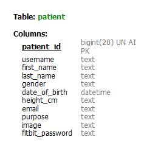
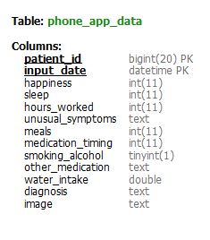
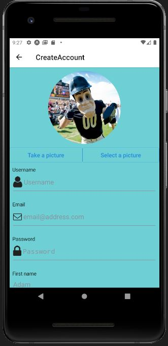
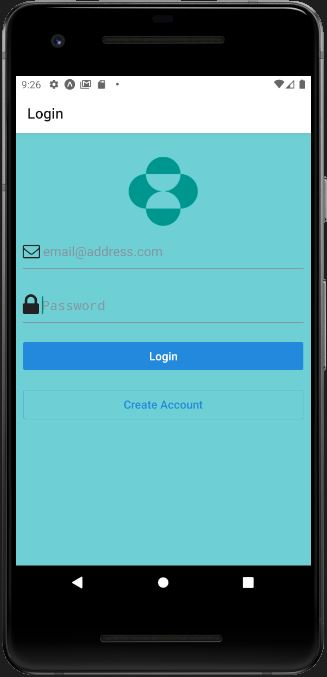
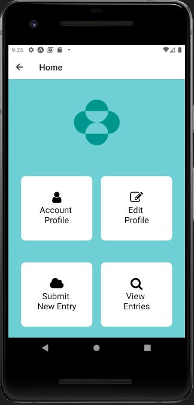
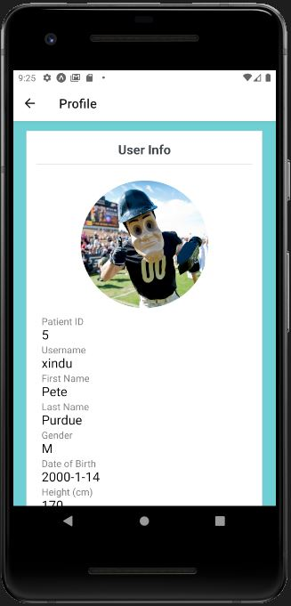
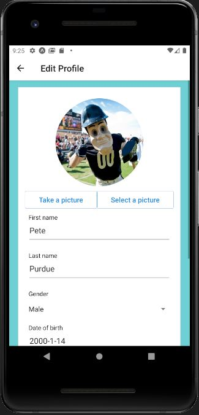
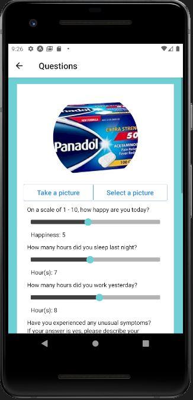
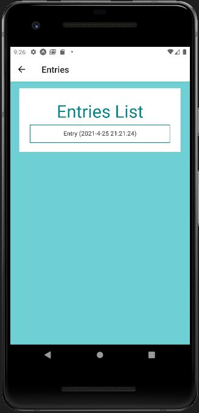

# Phone App Documentation

Team members: Abhimanyu Agarwal, Xin Du, Anav Sharma

## 1. How to Setup
**Note: You will not be able to run the application until you finish all the setup steps below. These steps make sure that your frontend (React Native), backend (Node.js), and the two databases used (Firebase and Amazon S3) are interconnected correctly. </br></br>
Note: A global search of the word "PUTYOURDATAHERE" will help you find all the places where you need to add your own config info. A more detailed instruction is also presented below.**</br>

Once you are in the root folder of the project repo, type "npm start" on the command line. The expo browser tool will open in your browser. Then, you can choose to run the application on browser (as a website), Android device, or Apple device. For the spring 2021 semester final version, the code works best on an Android device (you can either use an emulator or a real device), and it works mostly on website. We haven't had a chance to test it on Apple device.

In order to configure the frontend to work with your firebase authentication, correct credentials need to be put into "config.js" file located in /src/FireBase. To work with your Amazon S3, change the AMAZON_S3_DOMAIN variable to your Amazon S3 URL in the env.json file. The API_DOMAIN url is the URL of your backend.

For the Node.js backend, the root folder is at /backend/biometricBackend. Once you navigate there, you can type "node server.js" to start the server on port 3000.

In order to configure the backend to work with your MySQL database, correct credentials need to be put into "db.config.js" file located in /backend/biometricBackend/app/config.

In order to configure the backend to work with your Amazon S3, correct credentials need to be put into /backend/biometricBackend/app/controllers/image.controller.js. Some tutorials that might help you include https://medium.com/@otoloye/uploading-files-to-aws-s3-using-nodejs-multer-mongodb-and-postman-part-1-de790b8131d4.

## 2. Technologies Used
The phone application Frontend is built with React-native and Expo CLI. 
Backend is supported by Firebase, AWS S3, mySQL and Node.js. 

Firebase is used for login authentication. User's email and password are stored in Firebase. Whenever the user wants to login, their provided credentials are checked against the values stored in the Firebase. The codes upon which this application is built are independently developed by our team members. The data used to develop the application is Biometric data collected currently only through Fitbit, though the goal is to expand the collection capability to be able to obtain Apple Watch data as well. 

This data is accessed through an external Merck API which is linked through an SCTP request. Our application’s users are patients and their information is very confidential, It is important to implement our login and authentication system securely. Instead of building a secure login system from scratch by ourselves, we chose to use a pre-existing login authentication solution--firebase. In firebase, users’ passwords are first encrypted and then stored. Even if hackers successfully gain access to firebase’s database, they still would not know the passwords because everything stored there is the encrypted version. 

We use Amazon S3 to store all of our user and questionnaire images. Unlike MySQL, Amazon S3 provides us with a ready-to-use file system that is more efficient to store large data such as images.

We use MySQL to store all the data other than images. The data schema of the two used tables for phone application are below:<br/>


<br/>
Information related to the data schema used in our MySQL database is in Data Architecture Team's document. 

Besides, our main backend is Node.js. It is used to help the Frontend communicate with the MySQL database. It also helps the frontend store image to Amazon S3 instance.

## 3. Application Description
The application is divided into 7 main pages. The description for each page is listed below:

### 3.1 Create Account Page
This page enables a user to build a new account by providing user personal information. Information gathered from this Frontend is stored using backend routes and models in mySQL database. One of the features of this page is that it enables the user to upload an image. This image is stored to Amazon S3 through Node.js. The Frontend would receive part of the url (a number) that it can use to display the image. 

For now, the image url is not stored into the database yet, although it's stored in the frontend as a state variable. Once the user fills all the inputs and click the button, all the data, along with the image url, will be stored into the database (as a new row in the patient table). At the same time, an user is created at firebase, which is later used for authentication.



### 3.2 Login Page
When user fills in the information and clicks the login button, the following executions take place. First, the credentials are checked against the Firebase authorisation data. Then, the credentials are also used to retrieve the unique patient id from the SQL database, which is used as the patient's identifier to grab corresponding data from the SQL database.



### 3.3 Home Page
The Home Page provides the user to choose from multiple features of the application. This page has a series of options that enable the user to click pictures, upload pictures and also make new entries. While this page does not explicitly communicate with the backend of the application, it is crucial for full functioning of the application. 


 
### 3.4 Account Profile Page
This page displays all the user corresponding information which is fetched using the Patient id. This patient is instrumental to grab all the corresponding information from the SQL database.



### 3.5 Edit Profile Page
Patient id is used to grab all the corresponding information from the SQL database and the information is displayed. The user can also modify the information and edit them in the SQL database. Once they edit it, the new information will be pulled again and displayed on the page. This page also enables the user to click picture and send it across for further analysis. Along with the feature to click pictures, the user can also upload images from local storage here. 



### 3.6 Questionnaire Page
Consisting of series of questions, this page is used to create or edit a new row in the phone_app_data table. If you enter this page from the home page, you are going to execute a POST request, thus creating a new row. If you enter this page from Entries page, you are going to execute a PUT request, thus modifying an existing row. Once you click the create/modify button, you will automatically go back to the home page.




### 3.7 Entries Page
Displays the patient entry information. Each entry made by the user is displayed. The data is fetched from all the rows with the current patient id in the phone_app_data table.



## 4. API endpoints (How Application's Frontend and Node.js Backend communicate)
| API url        | Task        |Frontend to Backend Data Format           | Backend to Frontend Data Format (return)          | Purpose  | Special Notes | Frontend Progress | Backend Progress |
| ------------- |-------------:| -------------:|:-------------:| -----:| -----: | -----: | -----: |
| /patient-questionnaire | POST | {patient_id: num, <br />happiness: num, <br /> sleep: num, <br /> hours_worked: num, <br /> unusual_symptoms: string, <br /> meals: num, <br /> medication_timing: num, <br />smoking_alcohol: boolean, <br /> other_medication: string, <br /> water_intake: num, <br /> diagnosis: string, <br /> image: string} | none | (used in Questions page) <br />when patient submits a questionnaire | backend creates "input_date" based on when it receives the API call and adds "input_date" column. This API fills everything in the phone_app_data table | Xin (complete) | Anav (complete) | 
| /image   | POST | ...   | ... | (used in any page that needs uploading image) <br /> This sends the image data to the server. The server sends back the key used to access the image on Amazon S3 |   | Xin (complete)  | Xin (complete) |
| /patient-account | POST | {first_name: string, <br /> last_name: string, <br /> username: string, <br /> email: string, <br /> gender: string, <br /> date_of_birth: string, <br /> height_cm: num, <br /> image: string} |  none | (used in Create Account page) <br />When user creates a new account |   | Xin (complete) | Xin (complete) |
| /patient-account/login | POST | {email: string} | {patientId: num} | (used in Login page) <br />When user logs in |   | Xin (complete) | Xin (complete) |
| /patient-account/{patientId} |  PUT | {first_name: string, <br /> last_name: string, <br /> username: string, <br /> email: string, <br /> gender: string, <br /> date_of_birth: string, <br /> height: num, <br /> image: string} | none | (used in Edit Profile page) <br />this modifies one row in the patient table |   | Xin (complet) | Xin (complete) |
| /patient-account/{patientId} |  GET | none | {patient_id: num, <br /> first_name: string, <br /> last_name: string, <br /> username: string, <br /> email: string, <br /> gender: string, <br /> date_of_birth: string, <br /> height: num, <br /> image: string} | (used in Profile page) <br />the server sends back one row of the patient table based on the given patient id | Used in Account Profile page | Xin (complet) | Xin (complete) |
| /patient-questionnaire |  GET | (as query) <br />?patientId | {input_date: string} | (used in View Entries page) <br />the server sends back all the entries belong to that patient | Used in Entries page | Xin (complete) | Anav (complete) |
| /patient-questionnaire | GET | (as query) <br />?patientId&dateTime |{patient_id: num, <br /> input_date: string, <br /> happiness: num, <br /> sleep: num, <br /> hours_worked: num, <br /> unusual_symptoms: string, <br /> meals: num, <br /> medication_timing: num, <br />smoking_alcohol: boolean, <br /> other_medication: string, <br /> water_intake: num, <br /> diagnosis: string, <br /> image: string} | (used in Entry Details page) <br /> the server sends back the specified entry | Used in Entry Details page | Xin (complete) | Anav (complete) |
| /patient-questionnaire | PUT | (as query) <br />?patientId&dateTime {patient_id: num, <br /> input_date: string, <br /> happiness: num, <br /> sleep: num, <br /> hours_worked: num, <br /> unusual_symptoms: string, <br /> meals: num, <br /> medication_timing: num, <br />smoking_alcohol: boolean, <br /> other_medication: string, <br /> water_intake: num, <br /> diagnosis: string, <br /> image: string}| none | (used in Entry Details page) <br /> the server sends back the specified entry | Used in Entry Details page | Xin (complete) | Anav (complete) |

## 5. Future Work
1) We are planning to experiment using Xcode to develop an Apple version of the application.
2) We are planning to optimize the Front-end and add new features similar to click pictures, making new entries and uploading pictures.

## 6. Creation of Dummy Data

### 6.1 Why do we need dummy data?
In order to effectively test the functionality of the backend code, a lot of pre-existing data is needed to fill the database to simulate a normal functioning environment for the app. Initially, we only had about 40 users' data, and it was not enough. Therefore, we decided to create fake user data based on pre-existing user data (dummy data).

### 6.2 How we generated dummy data?
In order to let dummy data make sense and follow pre-existing data's patterns, we studied the patterns of each pre-existing data category. There are active, basal, dist, elev, heart, and steps data. We mostly used user 185 and 186's dataset as the reference while creating dummy dataset. 

For the active data, we first calculated the mean value of the original data. Then we found out the number of data points above the mean. Because it can be observed that within each active data set, data points above the mean value cluster into three group, and one of them always starts at the beginning. Therefore, we also chose the start as the position of the first high value data cluster, and randomly chose position for the other two. The value of each data point was chosen based on the observed range of the reference data point. 

The result of fake data vs. real data graph can be found below:\
{width=50%}

For other data categories, we utilized similar approaches while ajusting parameters and the possible range of random number generation based on each data categories' own characteristics. Below are the fake data vs. real data comparison graphs for other data categories.

For basal data:  
<br/>
For Dist data:  
<br/>
For Elev data:  
<br/>
For Heart data:  
<br/>
For Steps data:  
<br/>

### 6.3 How to run the scripts?
In order to run the scripts, some modifications to the GenerateFakeData.py are needed. There are three parameters that need modification: folder_name_list, real_name_list, and path. "folder_name_list" tells the name of the folders that will contain the dummy data. "real_name_list" tells the name of the reference files being used to generate dummy data. "path" is the current directory. Once these three parameters are set up correctly, just directly run the GenerateFakeData.py script with no input.

### 6.4 Potential improvements
Because our dummy data generation script is specifically modified for each data set, if in the future a new type of data appears, we need to rewrite our code in order to accommodate the new data type. Therefore, we can improve our code by applying more statictical knowledge so that the code can be applied to generate dummy data from more different data types.

## 7. Creating a connection between API Endpoints

### 7.1 List of API end-points:

1. Front-End Patient User input to the database
2. Biometric Data from the FitBit API to the database
3. Data from the database to the RShiny Dashboard for visualization

### 7.2 What framework we are going to use?

We are currently looking to use the framework Express.js to write the routes between the database and various API endpoints.

Express is a fast, light-weight web framework for Node.js. Express is a pretty good framework. It's the most popular node application framework out there. Express is widely used as middleware in node apps as it helps to organize your app into a MVC architecture. It's the E of the popular MEAN stack. Express manages following things very easily:

- Routing
- Sessions
- HTTP requests
- Error handling

At times writing code from scratch for above things can be time consuming. But by using express it's only a matter of few methods. Express also helps in organizing your code.

[Link to set up Node](https://medium.com/@onejohi/building-a-simple-rest-api-with-nodejs-and-express-da6273ed7ca9)

### 7.3 Setting up SQL database connection:

We created a connection with the MariaDB database in our Node Rest API server to be able to send and receive data. The following link shows a tutorial on how we set up the connection.

[Link to setup SQL connection in Node](https://bezkoder.com/node-js-rest-api-express-mysql/)

### 7.4 Design of the Routes

There are five kinds of routes:

**GET**: The GET method requests a representation of the specified resource. Requests using GET should only retrieve data and should have no other effect. 

**POST**: The POST method requests that the server accept the entity enclosed in the request as a new subordinate of the web resource identified by the URI. The data POSTed might be, for example, an annotation for existing resources; a message for a bulletin board, newsgroup, mailing list, or comment thread; a block of data that is the result of submitting a web form to a data-handling process; or an item to add to a database.

**PUT**: The PUT method requests that the enclosed entity be stored under the supplied URI. If the URI refers to an already existing resource, it is modified; if the URI does not point to an existing resource, then the server can create the resource with that URI.

**DELETE**: The DELETE method deletes the specified resource.

**PATCH**: The PATCH method applies partial modifications to a resource

## 8. Hosting the database on a Server

### 8.1 Issues faced with hosting a database on Scholar:

1. Scholar is a small computer cluster, suitable for classroom learning about high performance computing (HPC). 
2. It can be accessed as a typical cluster, with a job scheduler distributing batch jobs onto its worker nodes, or as an interactive resource, with software packages available through a desktop-like environment on its login servers.
3. We tried to create a connection to the sql server hosted on this server from our local but we faced issues because there was a firewall preventing access to the database from a foreign  server
4. We tried running our Backend API on scholar but we were unable to install NodeJS, MySQLWorkbench and other packages on the server without authorization.

### 8.2 Work around

1. In order to install packages on scholar, we are expected to make requests to the administration with a list of all program lines to run in the form of a SLURM job.

2. The Simple Linux Utility for Resource Management (SLURM) is a system providing job scheduling and job management on compute clusters. With SLURM, a user requests resources and submits a job to a queue. The system will then take jobs from queues, allocate the necessary nodes, and execute them.

3. To submit work to a SLURM queue, you must first create a job submission file. 

More info can be found at the following link: [SLURM Job](https://www.rcac.purdue.edu/knowledge/weber/run/slurm)

### 8.3 How we proceeded

Since we have to make a request each time we have to install a package, we decided to make just one request with a complete list of all installation. As a result, we wanted to host a temporary database on AWS that we can connect to and test on using our local machine.

We created a copy of the entire database on AWS with the following credentials:

- Hostname: rnr56s6e2uk326pj.cbetxkdyhwsb.us-east-1.rds.amazonaws.com
- Username: cb3i17t0aqn6a4ff
- Password: e2l4k9zn24shcj42

## 9. Adding data to the database

### 9.1 Adding a CSV to the database

1. The data engineering team had made a script that creates a CSV file with all the users FitBit data when they make a request to the API
2. We decided to make a python script to load this csv data onto the database we hosted on AWS.

### 9.2 POST information

1. The JSON to add a datapoint to the database is as follows:
```text
 obj = {'collection_date': row["Date"],
           'steps': row["Steps"],
           'floors_climbed': row["Floors Climbed"],
           'total_miles': row["Total Miles"],
           'lightly_active_miles': ["Lightly Active Miles"],
           'moderately_active_miles': row["Moderately Active Miles"],
           'very_active_miles': row["Very Active Miles"],
           'sedentary_minutes': row["Sedentary Minutes"],
           'lightly_active_minutes': row["Lightly Active Minutes"],
           'fairly_active_minutes': row["Fairly Active Minutes"],
           'very_active_minutes': row["Very Active Minutes"],
           'hr30_100_minutes': row["HR 30-100 Minutes"],
           'hr100_140_minutes': row["HR 100-140 Minutes"],
           'hr140_170_minutes': row["HR 140-170 Minutes"],
           'hr170_220_minutes': row["HR 170-220 Minutes"],
           'average_resting_heartrate': row["Average Resting HR"],
           'bmi': row["BMI"],
           'sleep_efficiency': row["Sleep Efficiency"],
           'weight': row["Weight"],
           'minutes_asleep': row["Minutes Alseep"],
           'fbusername': row["username"]
           }
```

2. We made structures in this form by reading the CSV information into a pandas dataframe and made a post request to our API

### 9.3 Patient information and Study Specific Data

The patient information is sent to the database form a webpage which will be used by Merck Scientists to load the patients they are studying during a clinical trial.

The JSON for a patient is as follows:
```text
{
  patient_id,
  fbusername,
  first_name,
  last_name,
  gender,
  date_of_birth,
  height
}
```

The JSON for the study data is as follows:
```text
{
    patient_id,
    input_date,
    family_history_cancer,
    family_history_heart_disease,
    diagnostic_notes
}
```
